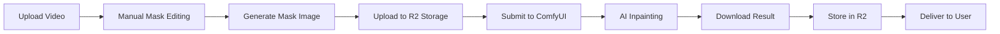

# 🎬 Sora2 Watermark Remover

**AI-Powered Video Watermark Removal Tool**

[](https://nextjs.org/)
[](https://www.typescriptlang.org/)
[](LICENSE)
[](https://sora2watermarkremover.net)

[🌐 Live Demo](https://sora2watermarkremover.net) | [📖 Documentation](https://sora2watermarkremover.net/docs) 

[English](README.md) | [简体中文](README_CN.md)

</div>


---

## 📋 Table of Contents

- [Overview](#-overview)
- [Features](#-features)
- [Technology Stack](#-technology-stack)
- [How It Works](#-how-it-works)
- [Quick Start](#-quick-start)
- [Usage Guide](#-usage-guide)
- [API Integration](#-api-integration)
- [Technical Implementation](#-technical-implementation)
- [FAQ](#-faq)
- [Contributing](#-contributing)
- [License](#-license)

---

## 🌟 Overview

**Sora2 Watermark Remover** is an advanced AI-powered web application designed to seamlessly remove watermarks from Sora-generated videos. Built with cutting-edge deep learning technology and computer vision models, it provides professional-grade watermark removal with an intuitive user interface.

### Why Sora2 Watermark Remover?

- 🎯 **Precision Removal**: AI-powered detection and removal of "Made with Sora" watermarks
- 🖱️ **Manual Control**: Interactive mask editor for precise watermark region selection
- ⚡ **Fast Processing**: Optimized ComfyUI workflow for efficient video processing
- 🎨 **Seamless Results**: Advanced inpainting algorithms ensure natural-looking output
- 🔒 **Privacy First**: All processing happens securely with your data protected

---

## ✨ Features

### Core Capabilities

- **🎭 AI Watermark Detection**: Automatic detection of Sora watermarks using computer vision
- **✏️ Manual Mask Editing**: Interactive canvas-based watermark region marking with React Konva
- **🎬 Video Processing**: Support for MP4, MOV, and other common video formats
- **📊 Queue Management**: Smart task queue system for handling multiple videos
- **💾 Cloud Storage**: Seamless integration with Cloudflare R2 for video storage
- **🌍 Multi-language Support**: Available in 21+ languages with next-intl
- **📱 Responsive Design**: Works perfectly on desktop, tablet, and mobile devices

### Advanced Features

- **Real-time Preview**: Live mask preview before processing
- **Batch Processing**: Process multiple videos in queue
- **Credit System**: Flexible credit-based pricing model
- **User Dashboard**: Track processing history and manage videos
- **Social Sharing**: Share processed videos with custom URLs
- **API Access**: RESTful API for developers (coming soon)

---

## 🛠️ Technology Stack

### Frontend
- **Framework**: [Next.js 15](https://nextjs.org/) with App Router
- **Language**: [TypeScript 5.7](https://www.typescriptlang.org/)
- **UI Components**: [Radix UI](https://www.radix-ui.com/) + [Tailwind CSS](https://tailwindcss.com/)
- **Canvas Editing**: [React Konva](https://konvajs.org/docs/react/)
- **State Management**: React Hooks + Context API
- **Internationalization**: [next-intl](https://next-intl-docs.vercel.app/)

### Backend
- **Database**: [PostgreSQL](https://www.postgresql.org/) with [Drizzle ORM](https://orm.drizzle.team/)
- **Authentication**: [NextAuth.js](https://next-auth.js.org/)
- **Payment**: [Stripe](https://stripe.com/) integration
- **Storage**: [Cloudflare R2](https://www.cloudflare.com/products/r2/)
- **AI Processing**: [ComfyUI API](https://github.com/comfyanonymous/ComfyUI)

### Infrastructure
- **Deployment**: [Vercel](https://vercel.com/) / [Cloudflare Pages](https://pages.cloudflare.com/)
- **CDN**: Cloudflare
- **Analytics**: OpenPanel
- **Monitoring**: Built-in logging and error tracking

---

## 🔬 How It Works

### Processing Pipeline



### Technical Workflow

1. **Video Upload**: User uploads Sora video (supports drag & drop)
2. **Mask Creation**: Interactive canvas allows precise watermark region marking
3. **Mask Generation**: Convert marked regions to PNG mask image
4. **Cloud Upload**: Upload original video and mask to Cloudflare R2
5. **ComfyUI Processing**: 
   - Load video and mask into ComfyUI workflow
   - Apply AI inpainting using U-Net architecture
   - Process frame-by-frame with context awareness
6. **Result Delivery**: Download processed video and store in R2
7. **User Access**: Provide download link and preview

---

## 🚀 Quick Start

### Prerequisites

- Node.js 18+ and pnpm
- PostgreSQL database
- Cloudflare R2 account
- ComfyUI server (for processing)

### Installation

```bash
# Clone the repository
git clone https://github.com/yourusername/sora2-watermark-remover.git
cd sora2-watermark-remover

# Install dependencies
pnpm install

# Set up environment variables
cp .env.example .env.development

# Configure your environment variables
# - Database connection (PostgreSQL)
# - Cloudflare R2 credentials
# - ComfyUI API endpoint
# - NextAuth secret
# - Stripe keys (optional)

# Run database migrations
pnpm db:push

# Start development server
pnpm dev
```

Visit `http://localhost:3000` to see the application.

---

## 📖 Usage Guide

### For End Users

1. **Visit Website**: Go to [sora2watermarkremover.net](https://sora2watermarkremover.net)
2. **Upload Video**: Click "Upload Video" or drag & drop your Sora video
3. **Mark Watermark**: Use the interactive editor to mark watermark regions
4. **Process**: Click "Remove Watermark" to start AI processing
5. **Download**: Get your watermark-free video in minutes

### For Developers

```typescript
// Example: Using the video watermark removal hook
import { useVideoWatermarkRemoval } from '@/hooks/useVideoWatermarkRemoval';

function MyComponent() {
  const { status, actions } = useVideoWatermarkRemoval();

  const handleUpload = (file: File) => {
    actions.selectFile(file);
  };

  const handleProcess = async () => {
    await actions.startProcessing();
  };

  return (
    <div>
      <input type="file" onChange={(e) => handleUpload(e.target.files[0])} />
      <button onClick={handleProcess}>Remove Watermark</button>
      {status.state === 'completed' && (
        <video src={status.processedVideoUrl} controls />
      )}
    </div>
  );
}
```

---

## 🔌 API Integration

### REST API (Coming Soon)

```bash
# Submit video for processing
POST /api/video-watermark/submit
Content-Type: multipart/form-data

{
  "video_file": <file>,
  "mask_data_url": "data:image/png;base64,...",
  "mask_rectangles": [...]
}

# Check processing status
GET /api/video-watermark/status/{task_uuid}

# Get user's video history
GET /api/video-watermark/my-videos
```

---

## 🧪 Technical Implementation

### ComfyUI Workflow

The application uses a sophisticated ComfyUI workflow that:

- Supports both horizontal and vertical video orientations
- Applies conditional branching based on video dimensions
- Uses advanced inpainting models for seamless watermark removal
- Processes videos frame-by-frame with temporal consistency


### Performance Optimizations

- **Queue System**: Smart task queue prevents server overload
- **GPU Acceleration**: ComfyUI leverages CUDA for fast processing
- **CDN Delivery**: Cloudflare CDN for global video delivery
- **Lazy Loading**: Optimized asset loading for better UX
- **Database Indexing**: Optimized queries for fast data retrieval

---

## ❓ FAQ

**Q: Is this legal to use?**  
A: This tool is for personal, educational, and research purposes. Commercial use should comply with OpenAI's terms of service.

**Q: How long does processing take?**  
A: Typically 3-5 minutes for a 15-second video, depending on queue length and video complexity.

**Q: What video formats are supported?**  
A: MP4, MOV, MKV, WebM, and most common video formats.

**Q: Can I process 4K videos?**  
A: Yes, but processing time will be longer. We recommend 1080p for optimal balance.

**Q: Is my video data safe?**  
A: Yes, all videos are encrypted and stored securely in Cloudflare R2. We don't share your data.

---

## 🤝 Contributing

We welcome contributions! Please see our [Contributing Guide](CONTRIBUTING.md) for details.

### Development Workflow

1. Fork the repository
2. Create a feature branch (`git checkout -b feature/amazing-feature`)
3. Commit your changes (`git commit -m 'Add amazing feature'`)
4. Push to the branch (`git push origin feature/amazing-feature`)
5. Open a Pull Request

---

## 📄 License

This project is licensed under the MIT License - see the [LICENSE](LICENSE) file for details.

---

## 🙏 Acknowledgments

- [ComfyUI](https://github.com/comfyanonymous/ComfyUI) for the powerful AI processing engine
- [Next.js](https://nextjs.org/) team for the amazing framework
- [Vercel](https://vercel.com/) for hosting and deployment
- All contributors and users of this project

---

## 📞 Contact & Support

- **Website**: [sora2watermarkremover.net](https://sora2watermarkremover.net)
- **Email**: support@sora2watermarkremover.net
- **GitHub Issues**: [Report a bug](https://github.com/yourusername/sora2-watermark-remover/issues)

---

<div align="center">

**Made with ❤️ by the Sora2 Watermark Remover Team**

[⬆ Back to Top](#-sora2-watermark-remover)

</div>
